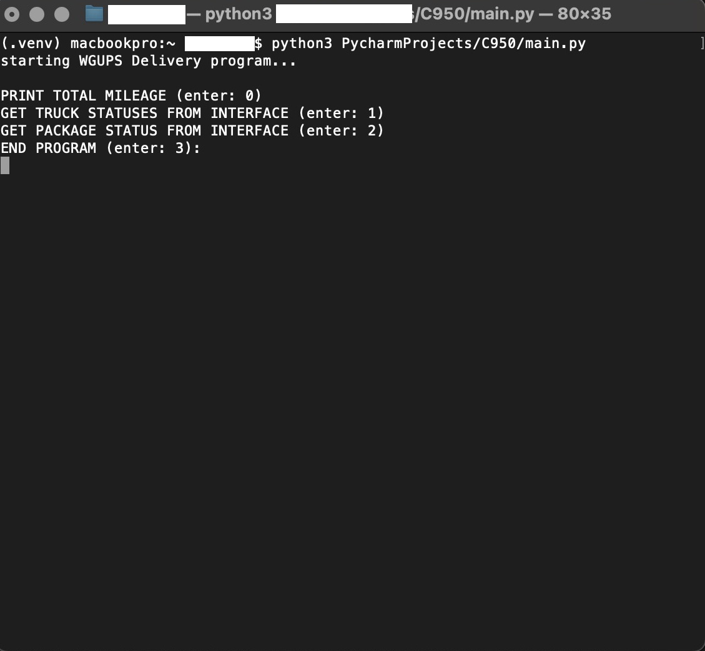
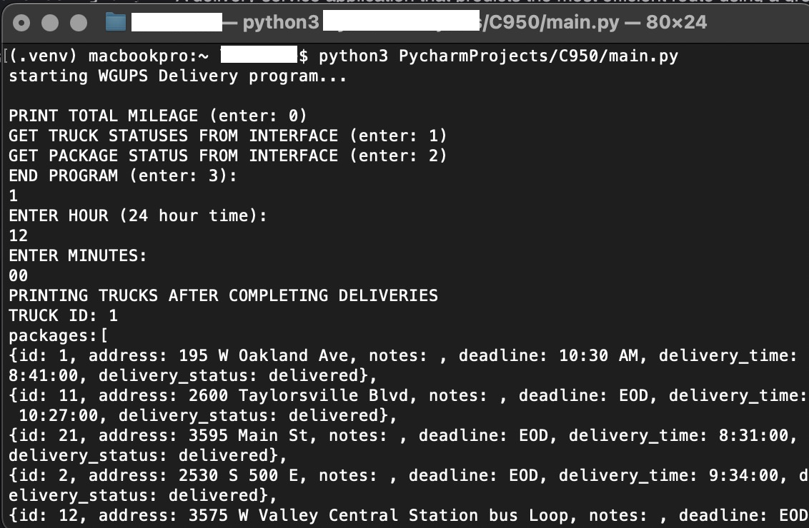
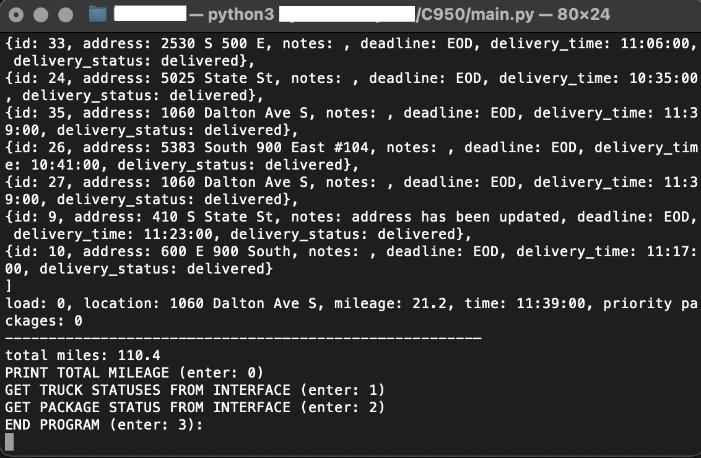

# WGUPS Delivery 

## Overview
A delivery service application that predicts the most efficient route using a greedy and nearest neighbor based algorithm

A user can interact with the application directly through the command line terminal and is given printed prompts. The program starts when given user input and performs different functions depending on the input 

## Demonstration

### example #1 - Getting the total mileage travelled at 12:00 pm
  

 ...end on print statement

